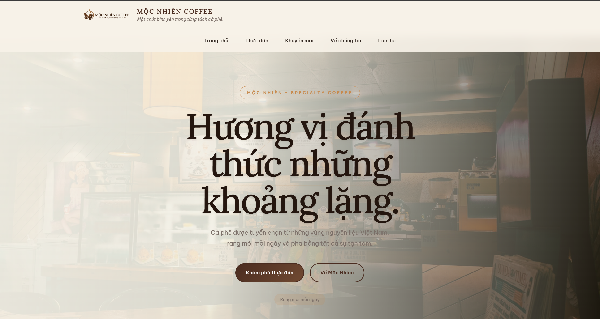
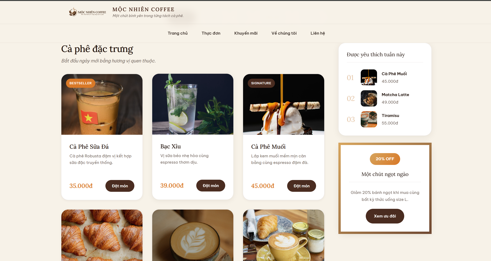
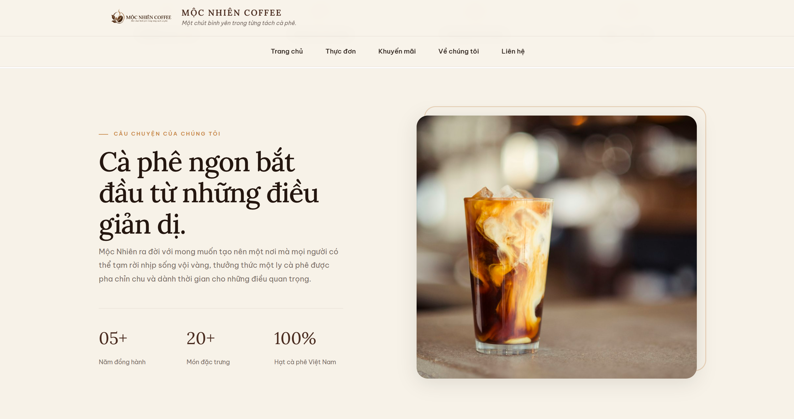
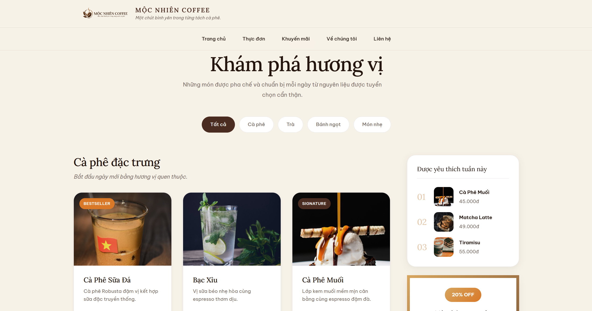

# Mộc Nhiên Coffee - Website Thực Đơn

Website thực đơn quán cà phê **Mộc Nhiên Coffee** - mang đến một chút bình yên trong từng tách cà phê.



---

## Giới Thiệu

**Mộc Nhiên Coffee** là website thực đơn cho quán cà phê với các tính năng:

- **Header** với logo và navigation menu
- **Hero Section** với hình ảnh ấn tượng
- **Info Bar** hiển thị thông tin nổi bật
- **Thực Đơn** phong phú với cà phê, trà và bánh ngọt
- **Khuyến Mãi** hấp dẫn
- **Giới Thiệu** về quán
- **Footer** với thông tin liên hệ



---

## Thực Đơn Đa Dạng

### Cà Phê
- Americano, Cappuccino, Latte
- Cà Phê Muối, Cà Phê Sữa Việt Nam
- Bạc Xĩu

### Trà & Nước Giải Khát
- Trà Đào, Trà Vải, Trà Sữa Ô Long
- Matcha Latte

### Bánh Ngọt
- Tiramisu, Basque Cheesecake, Brownie
- Croissant, Bánh Mì Gà Phô Mai



---

## Cấu Trúc Dự Án

```
Web-cafe/
├── ketqua/                    # Ảnh kết quả demo
│   └── *.png
├── BaiTap1_MSSV_HoTen_MenuQuanAn/
│   ├── html/
│   │   └── index.html         # Trang chính
│   ├── css/
│   │   └── style.css          # Stylesheet
│   └── images/                # Hình ảnh sản phẩm
│       ├── logomain.jpg
│       ├── hero-coffee.jpg
│       ├── *.jpg
│       └── *.svg
└── README.md
```

---

## Công Nghệ Sử Dụng

- **HTML5** - Cấu trúc trang web
- **CSS3** - Thiết kế giao diện (Flexbox, Grid, Animations)
- **Google Fonts** - Font Lora & Be Vietnam Pro
- **Responsive Design** - Tương thích mọi thiết bị

---

## Xem Demo

Mở file `BaiTap1_MSSV_HoTen_MenuQuanAn/html/index.html` trong trình duyệt để xem website.



---

> **Mộc Nhiên Coffee** - Một chút bình yên trong từng tách cà phê.
